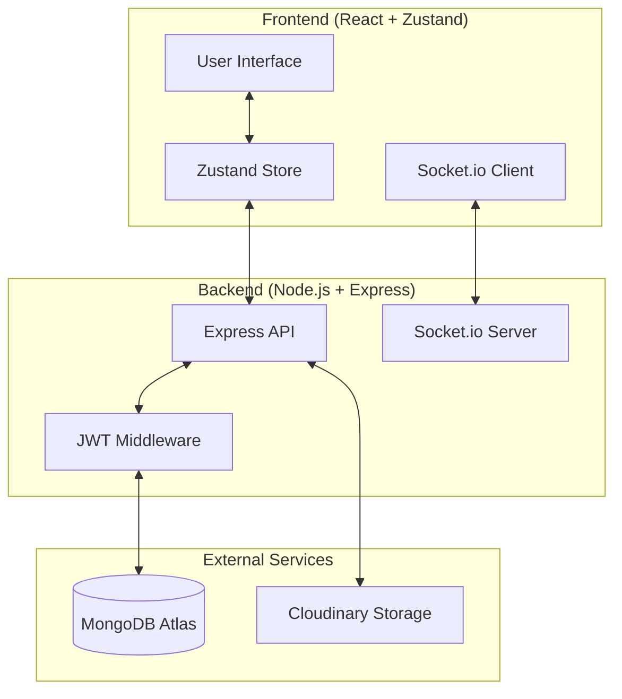

# 🗨️ ZenChat: Production-Grade Real-Time Messaging Platform

[](https://opensource.org/licenses/ISC)
[](https://react.dev/)
[](https://nodejs.org/)
[](https://socket.io/)
[](https://www.mongodb.com/)

ZenChat is a high-performance, real-time messaging ecosystem built with the MERN stack. It leverages bi-directional event-based communication to provide a seamless user experience, mimicking the responsiveness of modern enterprise chat solutions.

---

## 🏗️ System Architecture



---

## 🚀 Key Technical Highlights

-   **State Synchronization**: Uses **Zustand** for transient state management, reducing re-render cycles compared to Context API or Redux.
-   **Bi-Directional Communication**: Implements **Socket.io** for real-time message broadcasting and online/offline status tracking.
-   **Cloud-Native Media**: Integrated with **Cloudinary** for scalable, high-availability image hosting and transformation.
-   **Security-First Auth**: Implements JWT-based authentication via **HTTP-only cookies**, mitigating XSS and providing a stateless but secure session.

---

## ✨ Feature Set

### 🛡️ Enterprise-Grade Security
-   **JWT Auth**: Secure login/signup with auto-expiry and secure cookie storage.
-   **Bcrypt Hashing**: Industry-standard salt/hash for credential storage.
-   **Protected Routes**: Granular middleware-level access control for all API endpoints.

### 💬 Rich Messaging
-   **Instant Delivery**: Near-zero latency message delivery via WebSockets.
-   **Multimedia Support**: Base64-to-Cloudinary image pipeline for fast media sharing.
-   **User Presence**: Real-time tracking of online/offline status across the network.
-   **Chat History**: Persistent conversation storage with optimized MongoDB indexing.

### 🎨 Modern UI/UX
-   **Dynamic Theming**: Integrated DaisyUI themes for system-wide aesthetic consistency.
-   **Responsive Layout**: Mobile-first architecture using Tailwind CSS flex/grid systems.
-   **Feedback Loops**: Real-time toast notifications for system events (login success, errors, etc.).

---

## 📂 Project Orchestration

```text
chat-app/
├── backend/                # Scalable Express Architecture
│   ├── src/
│   │   ├── controllers/    # Request handling & Business Logic
│   │   ├── lib/            # Shared Utilities (DB, Sockets, Cloudinary)
│   │   ├── middleware/     # Auth, Logging, Validation
│   │   ├── models/         # Mongoose Data Schemas
│   │   ├── routes/         # RESTful API Definitions
│   │   └── seeds/          # Data Initialization Scripts
├── frontend/               # React + Vite Ecosystem
│   ├── src/
│   │   ├── components/     # Atomic UI Components
│   │   ├── store/          # Zustand State Architecture
│   │   └── pages/          # Domain-driven View Components
└── package.json            # Unified build & orchestration
```

---

## 🛠️ Engineering Setup

### Prerequisites
- **Node.js**: v18.x or higher
- **MongoDB**: v6.0+ (Atlas recommended)
- **Package Manager**: npm v9+

### Quick Start

1. **Clone & Install**:
   ```bash
   git clone https://github.com/Delincuente/mern-chat-app.git
   cd mern-chat-app
   npm install --prefix backend && npm install --prefix frontend
   ```

2. **Environment Configuration**:
   Create `backend/.env` with the following variables:

| Variable | Description | Example |
| :--- | :--- | :--- |
| `PORT` | Server listener port | `5001` |
| `MONGODB_URI` | Connection string | `mongodb+srv://...` |
| `JWT_SECRET_KEY` | HS256 Signing Key | `your_secure_hash` |
| `CLOUDINARY_CLOUD_NAME` | Cloudinary Account | `dwx...` |
| `CLOUDINARY_API_KEY` | API Identifier | `824...` |
| `CLOUDINARY_API_SECRET` | Secret Access Key | `tS-...` |
| `NODE_ENV` | Runtime environment | `development` |

3. **Development Mode**:
   ```bash
   # Terminal 1: Backend
   cd backend && npm run dev

   # Terminal 2: Frontend
   cd frontend && npm run dev
   ```

---

## 📡 API Interface Control

### Authentication Interface (`/api/auth`)
- `POST /signup` - Register new entity.
- `POST /login` - Authenticate & generate session cookie.
- `POST /logout` - Invalidate session.
- `GET /check` - Verify session integrity.
- `PUT /update-profile` - Mutate user metadata.

### Messaging Interface (`/api/message`)
- `GET /users` - Retrieve discoverable peer list.
- `GET /:id` - Retrieve chronological message stream with peer.
- `POST /:id/send` - Dispatch message/media payload.

---

## 🔐 Security Standards
- **CSRF Mitigation**: SameSite cookie attributes and CORS white-listing.
- **XSS Prevention**: React-native escaping and JSON body limits.
- **Data Integrity**: Mongoose schema validation and strict type checking.

---

## 🚀 Deployment Strategy

### Production Build
```bash
npm run build
```
This script installs dependencies for both tiers, builds the frontend assets, and moves them to the backend's distribution directory for optimized static serving.

### Recommended Stack
- **Compute**: AWS EC2, DigitalOcean Droplet, or Render.
- **Process Manager**: PM2 for zero-downtime reloads.
- **Proxy**: Nginx as a reverse proxy for SSL termination.

---

## 🗺️ Roadmap & Technical Debt
- [ ] **Automated Testing**: Integration of Vitest (Frontend) and Supertest (Backend).
- [ ] **Scaling**: Implementing Redis adapter for Socket.io horizontal scaling.
- [ ] **Message Status**: Real-time "Delivered" and "Seen" acknowledgments.
- [ ] **Typing Indicators**: WebSocket-based "User is typing..." events.
- [ ] **End-to-End Encryption**: Optional Signal protocol implementation for private chats.

---

## 🤝 Contributing & Standards

We follow the [GitHub Flow](https://docs.github.com/en/get-started/quickstart/github-flow). 

1. **Branching**: `feat/` for features, `fix/` for bugs, `refactor/` for code improvements.
2. **Commit Messages**: Follow [Conventional Commits](https://www.conventionalcommits.org/).
3. **Pull Requests**: Ensure code is linted (`npm run lint`) before submission.

---

## ⚖️ License
Distributed under the **ISC License**. See `LICENSE` for more information.

---

## ✍️ Author
**Hardik Butani**  
- GitHub: [@Delincuente](https://github.com/Delincuente)
- LinkedIn: [Hardik Butani](https://www.linkedin.com/in/hardik-butani-81816b231/)